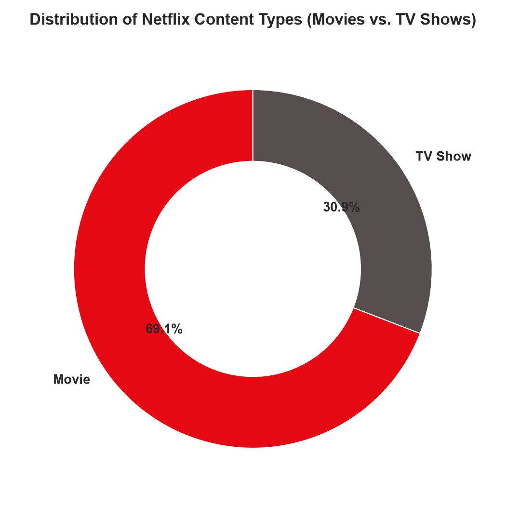
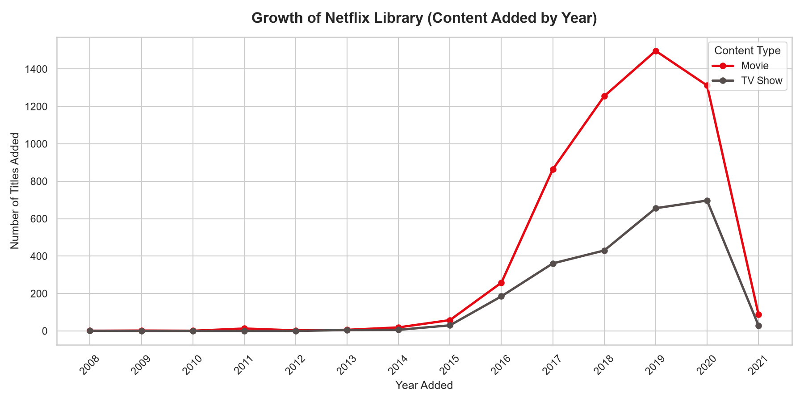
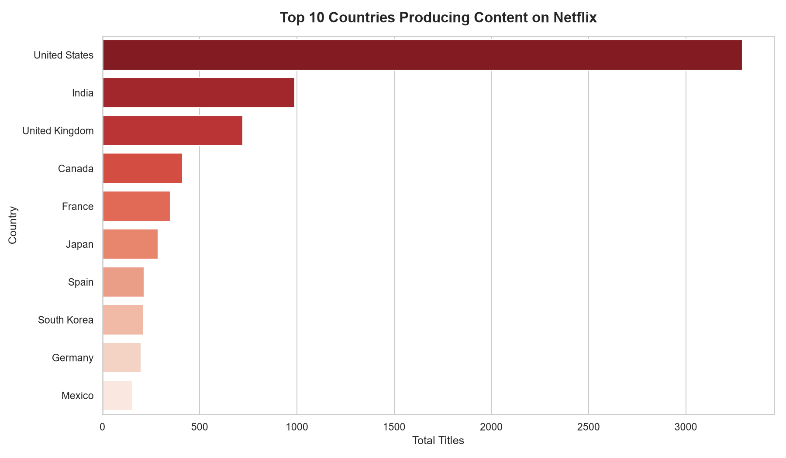
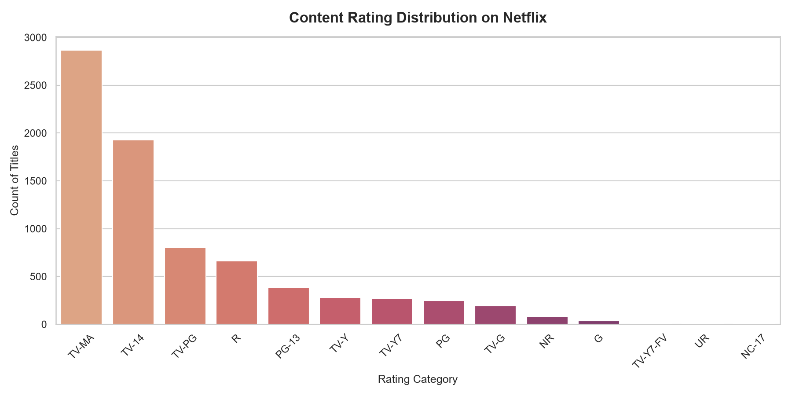
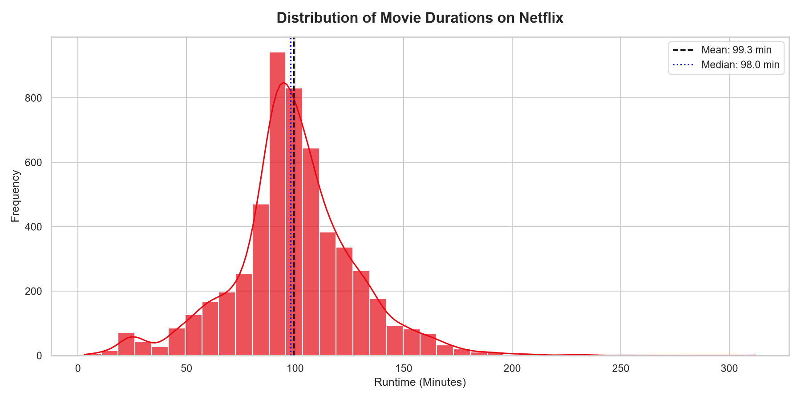
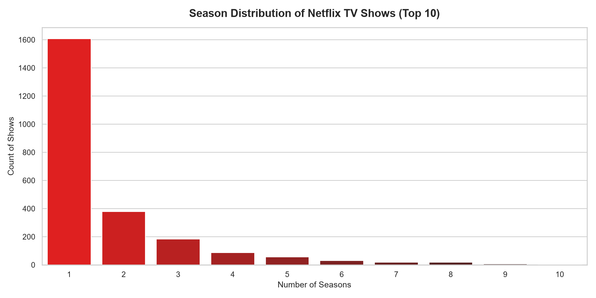

# Netflix Movies & TV Shows: Exploratory Data Analysis (EDA)


This repository contains a comprehensive **Exploratory Data Analysis (EDA)** of movies and TV shows available on Netflix. The analysis explores content distribution, library growth trends, top production hubs, audience ratings, and show durations. It answers business questions and tests hypotheses using statistical and visualization techniques.

---

## 📋 Table of Contents
1. [Project Structure](#-project-structure)
2. [Dataset Overview](#-dataset-overview)
3. [Key Exploratory Questions](#-key-exploratory-questions)
4. [Data Cleaning & Feature Engineering](#-data-cleaning--feature-engineering)
5. [Visualizations & Key Insights](#-visualizations--key-insights)
6. [Hypothesis Testing Results](#-hypothesis-testing-results)
7. [Data Anomalies & Future Scope](#-data-anomalies--future-scope)
8. [Installation & Usage](#-installation--usage)

---

## 📁 Project Structure

```text
├── data/
│   ├── netflix_titles.csv          # Raw dataset (downloaded automatically)
│   └── netflix_titles_cleaned.csv  # Cleaned, processed dataset
├── notebooks/
│   └── netflix_eda.ipynb           # Interactive Jupyter notebook with walk-throughs
├── plots/
│   ├── content_type_distribution.png
│   ├── movie_duration_distribution.png
│   ├── rating_distribution.png
│   ├── release_year_trends.png
│   ├── top_countries_content.png
│   ├── tv_season_distribution.png
│   └── stats_data.js               # Auto-generated summary statistics for the web UI
├── src/
│   ├── netflix_eda.py              # Python script containing the modular EDA pipeline
│   └── dashboard.js                # Interactive logic for the web dashboard
├── .gitignore                      # Git ignore file for temp data/caches
├── index.html                      # Premium web dashboard entry point
├── requirements.txt                # List of Python dependencies
└── README.md                       # Documentation and analysis summary
```

---

## 📊 Dataset Overview

The dataset contains listings of all movies and TV shows available on Netflix as of 2021. It has **7,787 rows** and **12 features**:

| Feature Name | Data Type | Description |
| :--- | :--- | :--- |
| `show_id` | String | Unique identifier for each listing |
| `type` | String | Category of listing (Movie or TV Show) |
| `title` | String | Title of the movie / show |
| `director` | String | Director(s) of the movie / show |
| `cast` | String | List of actor names in the cast |
| `country` | String | Country/countries of production |
| `date_added` | String | Date the title was added to Netflix |
| `release_year`| Integer | Actual release year of the movie / show |
| `rating` | String | Audience maturity rating (TV-MA, R, PG-13, etc.) |
| `duration` | String | Total duration (in minutes or season counts) |
| `listed_in` | String | Genre categories |
| `description` | String | Brief synopsis of the title |

---

## ❓ Key Exploratory Questions

Before analyzing the data, we formulated these key questions to guide our EDA:
- What is the proportion of Movies vs. TV Shows in the Netflix catalog?
- Which countries are the top production hubs for Netflix?
- How has content addition trended over the years? Has Netflix shifted focus?
- Who is the primary target audience (based on rating distribution)?
- What is the typical duration of Netflix movies and TV shows?

---

## 🛠️ Data Cleaning & Feature Engineering

To prepare the raw data for reliable analysis, the following processing steps were performed:
1. **Handling Missing Values**:
   - `director`: Filled missing values (30.68%) with `"Unknown Director"`.
   - `cast`: Filled missing values (9.22%) with `"No Cast"`.
   - `country`: Filled missing values (6.51%) with `"Unknown"`.
   - `rating`: Imputed missing values (0.09%) using the dataset's **mode** rating (`"TV-MA"`).
   - `date_added` & `duration`: Dropped rows with missing entries due to negligible occurrences (~13 rows).
2. **Datetime Formatting**:
   - Trimmed and parsed `date_added` into a standard datetime object (`YYYY-MM-DD`).
   - Extracted sub-features: `year_added`, `month_added`, and `day_added`.
3. **Standardizing Duration**:
   - Split `duration` to extract numerical values (`duration_num` as integer) and unit types (`duration_unit` as string, representing minutes or seasons).

---

## 📈 Visualizations & Key Insights

Here are the key insights generated from the exported plots:

### 1. Content Type Distribution
Movies represent the dominant content format on Netflix, making up nearly **69%** of the entire library, while TV Shows account for **31%**.



### 2. Netflix Library Growth Trends
Content addition started escalating heavily after 2015, peaking around 2019. While movie additions grew at a faster absolute rate, TV show additions have maintained consistent growth.



### 3. Top 10 Production Hubs
The United States is the primary supplier of content, followed by India (mostly Bollywood movies) and the United Kingdom.



### 4. Content Rating Distribution
Netflix content is heavily geared towards mature audiences, with the **TV-MA** (Mature Audience) rating being the single most common category, followed by **TV-14** (Parents Strongly Cautioned).



### 5. Movie Runtimes
Movie runtimes are tightly clustered around standard feature lengths. The median duration is **98 minutes**, and over **40%** of movies run between 90 and 110 minutes.



### 6. Season Distribution of TV Shows
For TV shows, Netflix leans heavily towards short-running series. An overwhelming majority of shows list only **1 Season** in the catalog, with a steep drop-off for multi-season titles.



---

## 🔬 Hypothesis Testing Results

### 🧪 Hypothesis 1: Netflix has shifted its focus from Movies to TV Shows in recent years.
- **Test**: Examine the ratio of additions from 2012 to 2021.
- **Result**: **Partially Disproven**. In absolute additions, Movies continue to outpace TV Shows. In 2020, Movies made up 65.3% of additions; in 2021, they accounted for 75.2%. However, the growth rate of TV Shows has increased significantly compared to the pre-2015 era.

### 🧪 Hypothesis 2: The majority of content is rated for mature audiences (TV-MA, R, NC-17).
- **Test**: Measure percentage of titles matching mature rating criteria.
- **Result**: **Validated**. Approximately **45.5%** of the entire catalog carries a mature audience rating (TV-MA, R, or NC-17).

### 🧪 Hypothesis 3: Movies on Netflix are typically 90 to 110 minutes long.
- **Test**: Analyze duration statistics for the 'Movie' category.
- **Result**: **Validated**. The average movie duration is **99.3 minutes** (median: 98.0). Exactly **40.3%** of all movies are between 90 and 110 minutes long.

---

## ⚠️ Data Anomalies & Future Scope

1. **Displaced Entries**: A few entries had incorrect listings where duration descriptions (e.g., `"74 min"`) were found in the `rating` column. Future pipelines should include sanity checks for data alignment.
2. **High Volume of Missing Directors**: Approximately 30% of titles lack director information. Merging this database with an external dataset (e.g., IMDB or TMDB API) would enrich the metadata and allow cast/crew network analysis.
3. **Country Co-productions**: Listings with multiple comma-separated countries require list-flattening to map accurately.

---

## ⚙️ Installation & Usage

### Prerequisites
- Python 3.8 or higher installed on your local machine.

### Installation
1. Clone this repository to your local machine:
   ```bash
   git clone <your-repository-url>
   cd "exploratory data analysis_code alpha"
   ```
2. Create and activate a virtual environment (optional but recommended):
   ```bash
   python -m venv .venv
   # Windows:
   .venv\Scripts\activate
   # macOS/Linux:
   source .venv/bin/activate
   ```
3. Install the required libraries:
   ```bash
   pip install -r requirements.txt
   ```

### Running the Analysis & Dashboard

1. **Run the EDA Pipeline**:
   Download the raw data, clean it, execute hypothesis tests, and export the charts and statistics:
   ```bash
   python src/netflix_eda.py
   ```

2. **Open the Web Dashboard**:
   Simply double-click the **`index.html`** file in your file explorer to open the interactive dashboard in your browser. Alternatively, you can serve it locally:
   ```bash
   # Using Python's built-in HTTP server:
   python -m http.server 8000
   # Then visit http://localhost:8000 in your browser
   ```

3. **Open the Jupyter Notebook**:
   For step-by-step interactive documentation of the code and outputs:
   ```bash
   jupyter notebook notebooks/netflix_eda.ipynb
   ```
